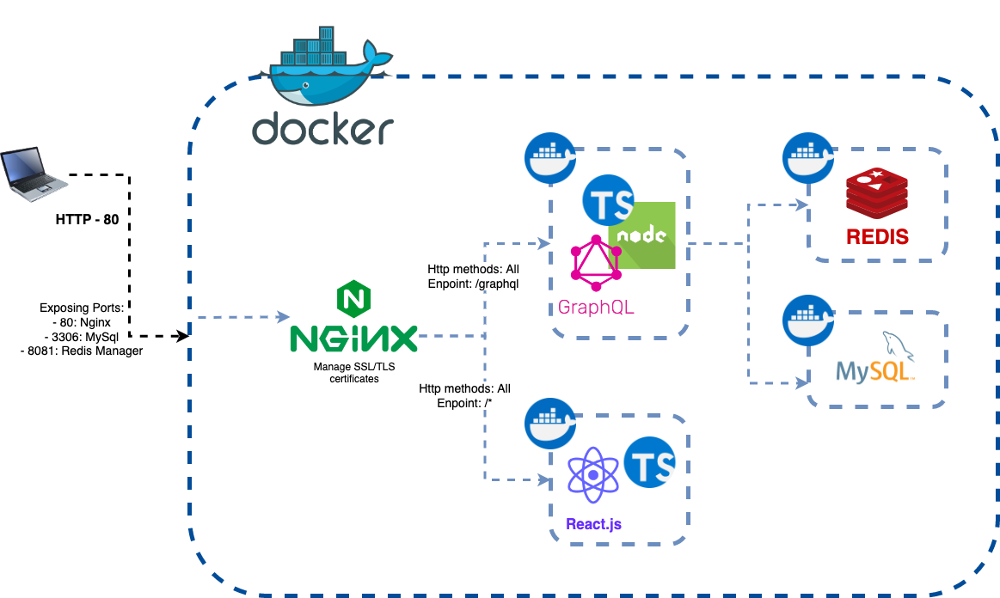
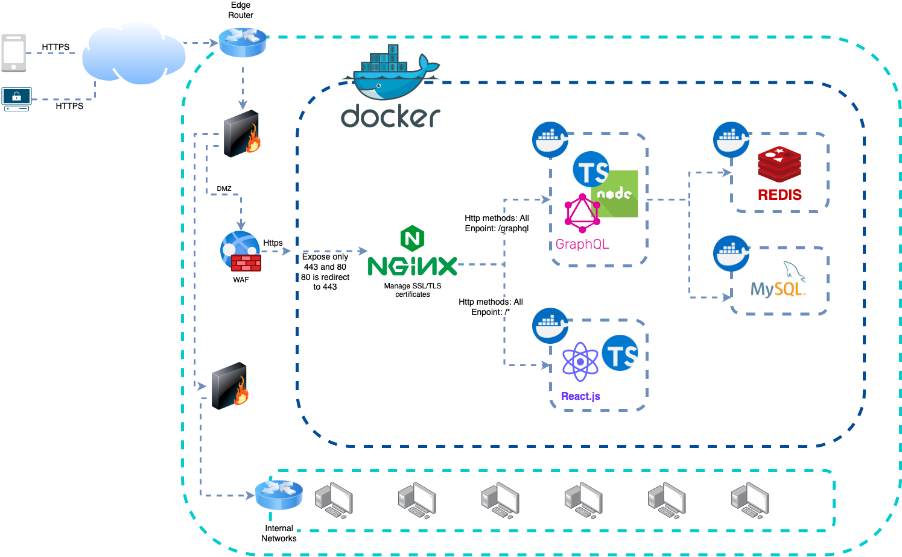

# Sistema de autenticación - segunda entrega Seguridad

Integrantes: Ignacio Barreto, German Rios, Sebastian Olivera, Patricio Zarauz

## Demo

https://user-images.githubusercontent.com/39178332/176276216-207c0cac-0634-4668-b612-c7f6b2695144.mov

## Requisitos

### Development environment

- [Docker >= 20.10.14](https://docs.docker.com/get-docker/)
- [Docker compose >= 1.29.2](https://docs.docker.com/compose/install/)
- [Node.js >= v16.15.1](https://nodejs.org/en/download/)

## Arquitecturas

## Development



## Production



## Levantar ambiente local para usar el proyecto

Primero se necesitan configurar las variables de entorno para su amibiente local, para esto hay que generar un `.env` en el directorio raíz del proyecto y como ejemplo de las variables necesarias encontrara en la misma ruta un archivo `.env.example` que tiene ejemplos para validar el formato que debería tener cada una de las variables.

Una vez configuradas las variables y cumpliendo con los requisitos de `docker` y `docker-compose`, para levantar y bajar el proyecto solo es necesario ejecutar los siguientes comandos

```bash
# levantar todos los servicios necesarios
docker-compose up -d

# bajar todos los servicios
docker-compose down

# bajar los servicios necesarios y borrar los datos de la base y redis
docker-compose down -v

# para ver que servicios se levantaron
docker ps

# con el siguiente comando puede ver los logs de cada uno de los servicios, si se agrega la opción -f se queda mostrando continuadamente los últimos logs
docker logs [options] <container_name>
```

Ahora en `http://localhost/graphql` puede acceder a la documentación y un dashboard de interacción con la api y en `http://localhost` puede acceder al dashboard principal.

**Solo para propósitos de desarrollo y test**, para comenzar a utilizar el sistema, interactuar y poder integrarse rápidamente al desarrollo, mediante migraciones, se han creado en la base de datos tres usuarios con tres niveles de privilegio diferentes, las siguientes son las credenciales de acceso para cada uno de los usuarios iniciales:

```bash
# usuario con rol administrador
usuario=admin
password=s3gur1d4dAdmin

# usuario con rol bibliotecario
usuario=funcionario1
password=s3gur1d4dFuncionario1

# usuario con rol normal
usuario=usuario1
password=s3gur1d4dUsuario1
```

## Para desarrollar en este proyecto

Se deberan instalar todas dependencias necesarias en las siguientes carpetas:

- ./services/api
- ./services/dashboard

En ambos casos ejecutar `npm install` o `yarn install` dependiendo  el gestor de paquetes de su preferencia y ya estaría en condiciones de programar en su IDE de preferencia. En cada proyecto se provee la configuración de editorconfig para los IDE que lo soporten, y si usa VsCode ya se encuentran todas las configuraciones iniciales para comenzar directamente a programar.
